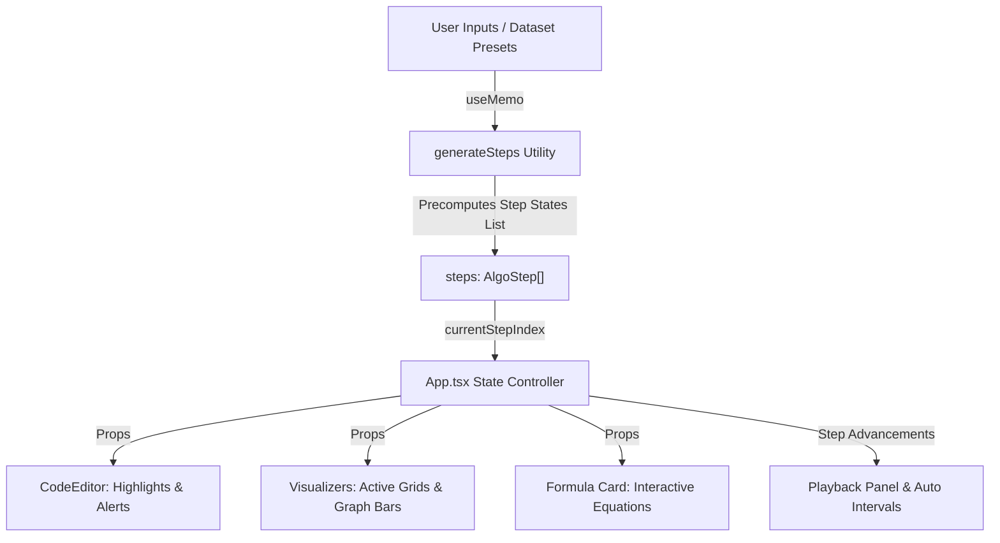

# 📊 DS Visualizer — High-Fidelity Interactive Algorithm Sandbox

[](https://opensource.org/licenses/MIT)
[](https://reactjs.org/)
[](https://vitejs.dev/)
[](https://www.typescriptlang.org/)
[](https://www.w3.org/Style/CSS/)

Welcome to **DS Visualizer**—a breathtaking, highly interactive, and gamified open-source React application designed to transform complex data structures and algorithm analysis into an engaging, visual sandbox. 

Powered by Vite, React, and TypeScript, this platform combines gorgeous glassmorphic dark-theme aesthetics with dynamic mathematical breakdowns, physics-based canvas particles, and interactive mnemonic aids to ensure you master tricky coding interview concepts for good.

---

## 🚀 Key Visualizer Modules

DS Visualizer currently features three high-fidelity sandbox modules targeting arrays, binary search, and dynamic programming:

### 1. 🪙 Coin Change II (`#518` · Medium)
Demystifies Bottom-Up 2D Dynamic Programming through a realistic memory-grid layout:
* **True Java Initialization**: The entire grid is initialized to muted `0`s from the start, matching Java's array memory allocation behavior.
* **Selective Highlighting**: Differentiates between loop boundary checks and actual array assignment operations. The cell `dp[i][j]` glows golden only during actual writes, while the top column index `j` is actively highlighted to show the current loop pointer.
* **Combination Logic Card**: Explains intermediate mathematical equations dynamically. Displays `Exclude Only` operations on intermediate lines, transitioning to the full sum (`Exclude + Include`) only when the inclusion write takes place.
* **Allowed vs. Banned Accordion Shortcut**: An interactive memory tip box built directly into the UX explaining the **"Permission Slip Rule"** of DP rows:
  * **Row `i` (Current Row)**: **Unlimited Supply (Allowed)** ➡️ stay in the current row because you can reuse this coin type.
  * **Row `i-1` (Row Above)**: **Single-Use (Banned)** ➡️ go to the row above because the coin type has been consumed.

### 📊 2. Median of Two Sorted Arrays (`#4` · Hard)
Visualizes hard binary search partitioning:
* **Interactive Partition Slices**: Shows binary search boundary adjustments dynamically, helping you see where the search splits the arrays.
* **Variable Champions Tracker**: Visualizes the max-left and min-right comparison elements (`maxLeftA`, `minRightA`, `maxLeftB`, `minRightB`) side-by-side.
* **Interactive Range Slices**: Highlights the shrinking `low` and `high` pointers live as binary search cuts down the search space.

### 🔄 3. Three Sum (3Sum) Accordion Squeeze (`#15` · Medium)
Traces the classic two-pointer squeeze:
* **Gamified Quiz Mode**: Pauses execution on calculation ticks, challenging you to evaluate the current sum and choose the correct pointer transition (`L++`, `R--`, or `Jackpot!`). Correct choices earn XP, building score streaks with dynamic fire micro-animations.
* **Particle Explosion Engine**: Triggers gravity-based canvas particle celebrations on correct answers and jackpot discoveries.
* **Accordion Analogy Cheat Sheet**: Relates pointer adjustments to the physical squeezing of a musical accordion:
  * ⚓ **Lock the Anchor ($i$)**: Fix one element to the floor and scan the remainder.
  * ❄️ **Too Cold? ($Sum < 0$)**: Squeeze the Left hand inward ($L \to$) to find larger values.
  * 🔥 **Too Hot? ($Sum > 0$)**: Squeeze the Right hand inward ($\gets R$) to find smaller values.
  * 🎉 **Harmony! ($Sum = 0$)**: Lock the triplet and squeeze both hands to continue.

---

## 💎 The Aesthetics & Themes Engine

The application is styled from scratch with vanilla CSS utilizing a modern **Glassmorphic Theme System** that responds to data-attributes injected on `document.body`:

* **Cyberpunk Purple** (`data-theme="purple"`): Accent `#a855f7`, secondary `#ec4899`.
* **Cyber Cyan** (`data-theme="cyan"`): Accent `#06b6d4`, secondary `#10b981`.
* **Solar Amber** (`data-theme="amber"`): Accent `#f59e0b`, secondary `#ef4444`.
* **Emerald Aurora** (`data-theme="aurora"`): Accent `#10b981`, secondary `#84cc16`.

All layouts leverage backdrop-filters, custom gradients, floating ambient glowing blobs, and high-fidelity transitions to create a premium feel.

---

## ⚙️ Architecture & Under the Hood

To guarantee zero lags during automatic scrubbing, rewind, fast-forward, and quiz triggers, DS Visualizer implements the **Precomputed State Generator Pattern**:



### The State Snapshot (`types/index.ts`)
Every step is snapshotted as a structured record. For example, the `CoinChange2Step` interface traces:
```typescript
export interface CoinChange2Step {
  coins: number[];
  amount: number;
  dp: number[][];         // Active state of grid memory
  currentRow: number;     // Active loop row i
  currentCol: number;     // Active loop col j
  revealed: boolean[][];  // 2D boolean array showing computed cells
  highlightedLine: number;// Active code line highlighted in IDE
  phase: 'init' | 'fill' | 'done';
  narrative: string;      // Conversational step-by-step description
  answer: number | null;
}
```

---

## 📁 Repository Directory Structure

```
src/
├── types/
│   └── index.ts                 # TypeScript type definitions and step interfaces
├── constants/                   # Custom presets, code line builders, and metadata
├── components/
│   ├── common/
│   │   ├── CodeEditor.tsx       # Premium simulated code IDE with custom alerts
│   │   ├── Sidebar.tsx          # Dynamic visualizer navigation menu
│   │   └── Header.tsx           # Branding logo, themed switches, and quiz status
│   └── problems/
│       └── arrays/
│           ├── threeSum/        # Three Sum core components, analogy sheet, particles
│           ├── medianOfTwoSortedArrays/  # Binary Search partition sliders
│           └── coinChange2/     # Dynamic Programming visual grids & breakdown logic
├── hooks/
│   ├── useInterval.ts           # Timing manager for automatic play intervals
│   └── useParticles.ts          # Physics-based canvas particles system
├── App.tsx                      # Primary controller coordinating active steps & global states
├── index.css                    # Custom CSS typography, variables, global design system
└── App.css                      # Global sandbox structure & custom components styling
```

---

## 💻 Keyboard Shortcuts

Interact with the visualizer sandboxes instantly using fast keyboard hotkeys:
* <kbd>Spacebar</kbd> — Play or pause the automatic interval simulation steps.
* <kbd>Arrow Right (⮕)</kbd> — Step forward one frame.
* <kbd>Arrow Left (⬅)</kbd> — Step backward one frame.
* <kbd>R</kbd> or <kbd>r</kbd> — Reset the active simulation (and clear game scores).

---

## 🛠️ Installation & Setup

Set up the project locally in less than a minute:

### 1. Prerequisites
Ensure you have [Node.js](https://nodejs.org/) installed (v16.0.0 or higher recommended).

### 2. Clone the Repository
```bash
git clone https://github.com/your-username/ds-visualiser.git
cd ds-visualiser
```

### 3. Install Dependencies
```bash
npm install
```

### 4. Start Development Server
```bash
npm run dev
```
Open your browser and navigate to `http://localhost:5173`.

### 5. Build for Production
```bash
npm run build
```
This builds the production-ready bundle into the `dist/` directory.

---

## 🤝 Contributing to Open Source

We love contributions! If you want to make DS Visualizer even more powerful, check out our recommended roadmap:

* **Add Multi-Language Mock IDE Tabs**: Introduce tabs for **Python**, **C++**, and **JavaScript** versions of the algorithms.
* **Additional Visualizer Categories**: Build visualizers for **Trees** (e.g. DFS/BFS traversals) or **Graphs** (e.g. Dijkstra's shortest path).
* **Chronological Step Scrubbing**: Add a timeline range slider to let users scrub to any step instantly.

### Contribution Steps:
1. Fork this repository.
2. Create a feature branch (`git checkout -b feature/awesome-feature`).
3. Commit your changes (`git commit -m 'Add awesome feature'`).
4. Push to the branch (`git push origin feature/awesome-feature`).
5. Open a Pull Request!

---

## 📄 License
This project is licensed under the [MIT License](LICENSE)—feel free to use, modify, and build upon it!
